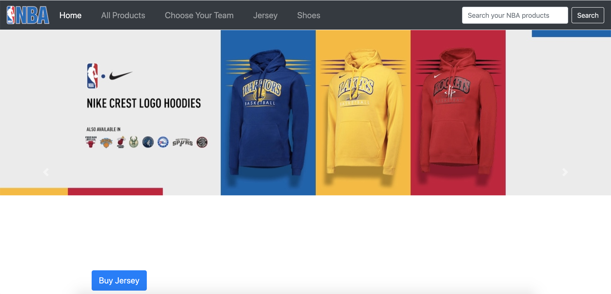
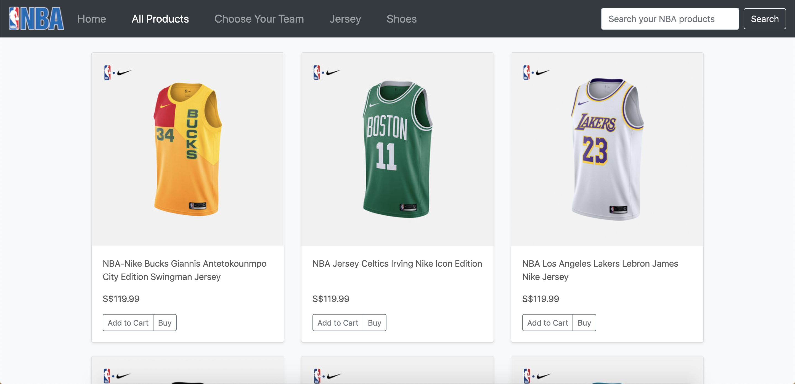

# IM2073-NBA-merchandise-e-shop

This is a project created for course IM2073 to demonstrate the ability to create a web application, focusing on front end.

  

<h3 align="center"> Home Page </h3>

With the following basic functions:
1. basic transition between pages
2. look and feel with boostrap styles

Disclaimer: The product images are from <a href="https://www.nba.com/" >NBA website</a>, solely for learning purposes.
